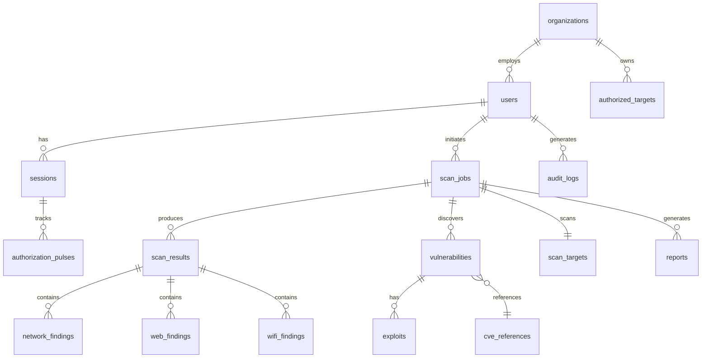

# Database Schema Design

> [!NOTE]
> This schema is designed for PostgreSQL 15+ with the following design principles:
> - Comprehensive audit logging
> - Authorization tracking
> - Scalability for large scan datasets
> - Real-time monitoring support
> - Legal compliance (evidence preservation)

## 📊 Entity Relationship Diagram



## 🗂️ Core Tables

### 1. Users & Authentication

#### `users`
Stores user account information and feature access.

```sql
CREATE TABLE users (
    id UUID PRIMARY KEY DEFAULT gen_random_uuid(),
    email VARCHAR(255) UNIQUE NOT NULL,
    username VARCHAR(100) UNIQUE NOT NULL,
    password_hash VARCHAR(255) NOT NULL,
    full_name VARCHAR(255),
    organization_id UUID REFERENCES organizations(id),
    role VARCHAR(50) NOT NULL DEFAULT 'analyst', -- admin, lead, analyst, viewer
    features JSONB NOT NULL DEFAULT '[]', -- ['wifi_scan', 'web_scan', 'exploit', etc.]
    is_active BOOLEAN DEFAULT true,
    terms_accepted_at TIMESTAMP,
    terms_version VARCHAR(20),
    created_at TIMESTAMP DEFAULT CURRENT_TIMESTAMP,
    updated_at TIMESTAMP DEFAULT CURRENT_TIMESTAMP,
    last_login_at TIMESTAMP,
    
    CONSTRAINT valid_email CHECK (email ~* '^[A-Za-z0-9._%+-]+@[A-Za-z0-9.-]+\.[A-Za-z]{2,}$')
);

CREATE INDEX idx_users_email ON users(email);
CREATE INDEX idx_users_organization ON users(organization_id);
CREATE INDEX idx_users_active ON users(is_active) WHERE is_active = true;
```

#### `sessions`
Active user sessions with JWT tokens.

```sql
CREATE TABLE sessions (
    id UUID PRIMARY KEY DEFAULT gen_random_uuid(),
    user_id UUID NOT NULL REFERENCES users(id) ON DELETE CASCADE,
    token_hash VARCHAR(255) UNIQUE NOT NULL,
    ip_address INET NOT NULL,
    user_agent TEXT,
    expires_at TIMESTAMP NOT NULL,
    revoked_at TIMESTAMP,
    created_at TIMESTAMP DEFAULT CURRENT_TIMESTAMP,
    last_activity_at TIMESTAMP DEFAULT CURRENT_TIMESTAMP,
    
    CONSTRAINT valid_session CHECK (expires_at > created_at)
);

CREATE INDEX idx_sessions_user ON sessions(user_id);
CREATE INDEX idx_sessions_token ON sessions(token_hash);
CREATE INDEX idx_sessions_active ON sessions(user_id, expires_at) 
    WHERE revoked_at IS NULL;
```

#### `authorization_pulses`
Tracks live authorization checks with central server.

```sql
CREATE TABLE authorization_pulses (
    id BIGSERIAL PRIMARY KEY,
    session_id UUID NOT NULL REFERENCES sessions(id) ON DELETE CASCADE,
    user_id UUID NOT NULL REFERENCES users(id),
    checked_at TIMESTAMP DEFAULT CURRENT_TIMESTAMP,
    status VARCHAR(20) NOT NULL, -- authorized, revoked, expired, error
    features_granted JSONB, -- Features active at this check
    central_server_response TEXT,
    next_check_at TIMESTAMP,
    
    CONSTRAINT valid_status CHECK (status IN ('authorized', 'revoked', 'expired', 'error'))
);

CREATE INDEX idx_pulses_session ON authorization_pulses(session_id, checked_at DESC);
CREATE INDEX idx_pulses_next_check ON authorization_pulses(next_check_at) 
    WHERE status = 'authorized';
```

### 2. Organizations & Authorization

#### `organizations`
Companies or teams using the platform.

```sql
CREATE TABLE organizations (
    id UUID PRIMARY KEY DEFAULT gen_random_uuid(),
    name VARCHAR(255) NOT NULL,
    domain VARCHAR(255),
    subscription_tier VARCHAR(50) DEFAULT 'basic', -- basic, professional, enterprise
    max_users INTEGER DEFAULT 5,
    features JSONB NOT NULL DEFAULT '[]',
    contact_email VARCHAR(255),
    is_active BOOLEAN DEFAULT true,
    created_at TIMESTAMP DEFAULT CURRENT_TIMESTAMP,
    updated_at TIMESTAMP DEFAULT CURRENT_TIMESTAMP
);

CREATE INDEX idx_organizations_name ON organizations(name);
```

#### `authorized_targets`
Pre-authorized targets for testing (legal compliance).

```sql
CREATE TABLE authorized_targets (
    id UUID PRIMARY KEY DEFAULT gen_random_uuid(),
    organization_id UUID NOT NULL REFERENCES organizations(id),
    target_type VARCHAR(50) NOT NULL, -- domain, ip_range, wifi_ssid, aws_account, etc.
    target_value TEXT NOT NULL,
    authorization_document_url TEXT,
    authorization_hash VARCHAR(64), -- SHA-256 of authorization document
    authorized_by VARCHAR(255) NOT NULL,
    valid_from TIMESTAMP NOT NULL,
    valid_until TIMESTAMP NOT NULL,
    scope_limitations JSONB, -- e.g., {"allowed_scans": ["port_scan"], "forbidden": ["dos"]}
    created_at TIMESTAMP DEFAULT CURRENT_TIMESTAMP,
    
    CONSTRAINT valid_authorization_period CHECK (valid_until > valid_from)
);

CREATE INDEX idx_authorized_targets_org ON authorized_targets(organization_id);
CREATE INDEX idx_authorized_targets_type ON authorized_targets(target_type, target_value);
CREATE INDEX idx_authorized_targets_valid ON authorized_targets(valid_from, valid_until);
```

### 3. Scan Management

#### `scan_targets`
Individual targets being scanned.

```sql
CREATE TABLE scan_targets (
    id UUID PRIMARY KEY DEFAULT gen_random_uuid(),
    target_type VARCHAR(50) NOT NULL, -- ip, domain, wifi_network, web_app, cloud_env
    target_value TEXT NOT NULL,
    metadata JSONB, -- Additional context (ports, URLs, etc.)
    created_at TIMESTAMP DEFAULT CURRENT_TIMESTAMP
);

CREATE INDEX idx_scan_targets_type ON scan_targets(target_type);
CREATE INDEX idx_scan_targets_value ON scan_targets USING hash(target_value);
```

#### `scan_jobs`
Individual scan operations.

```sql
CREATE TABLE scan_jobs (
    id UUID PRIMARY KEY DEFAULT gen_random_uuid(),
    user_id UUID NOT NULL REFERENCES users(id),
    organization_id UUID REFERENCES organizations(id),
    target_id UUID NOT NULL REFERENCES scan_targets(id),
    authorization_target_id UUID REFERENCES authorized_targets(id),
    
    scan_type VARCHAR(50) NOT NULL, -- wifi, port_scan, web_vuln, cloud_audit, etc.
    scan_mode VARCHAR(20) NOT NULL, -- on_demand, scheduled, continuous
    
    status VARCHAR(20) NOT NULL DEFAULT 'pending', -- pending, running, completed, failed, stopped
    priority INTEGER DEFAULT 5,
    
    configuration JSONB, -- Scan-specific settings
    
    started_at TIMESTAMP,
    completed_at TIMESTAMP,
    created_at TIMESTAMP DEFAULT CURRENT_TIMESTAMP,
    updated_at TIMESTAMP DEFAULT CURRENT_TIMESTAMP,
    
    progress_percentage INTEGER DEFAULT 0,
    current_phase VARCHAR(100), -- e.g., "Port Scanning", "Service Detection"
    
    error_message TEXT,
    
    CONSTRAINT valid_status CHECK (status IN ('pending', 'running', 'completed', 'failed', 'stopped')),
    CONSTRAINT valid_priority CHECK (priority BETWEEN 1 AND 10),
    CONSTRAINT valid_progress CHECK (progress_percentage BETWEEN 0 AND 100)
);

CREATE INDEX idx_scan_jobs_user ON scan_jobs(user_id, created_at DESC);
CREATE INDEX idx_scan_jobs_status ON scan_jobs(status, priority);
CREATE INDEX idx_scan_jobs_target ON scan_jobs(target_id);
CREATE INDEX idx_scan_jobs_type ON scan_jobs(scan_type);
```

#### `scan_results`
Aggregated results from scans.

```sql
CREATE TABLE scan_results (
    id UUID PRIMARY KEY DEFAULT gen_random_uuid(),
    scan_job_id UUID NOT NULL REFERENCES scan_jobs(id) ON DELETE CASCADE,
    
    result_type VARCHAR(50) NOT NULL, -- summary, detailed, raw
    
    summary JSONB, -- High-level findings
    risk_score INTEGER, -- 0-100
    severity_counts JSONB, -- {"critical": 2, "high": 5, "medium": 10, "low": 20}
    
    raw_data JSONB, -- Full scan output
    
    created_at TIMESTAMP DEFAULT CURRENT_TIMESTAMP,
    
    CONSTRAINT valid_risk_score CHECK (risk_score BETWEEN 0 AND 100)
);

CREATE INDEX idx_scan_results_job ON scan_results(scan_job_id);
CREATE INDEX idx_scan_results_type ON scan_results(result_type);
```

### 4. Vulnerability Management

#### `vulnerabilities`
Discovered vulnerabilities.

```sql
CREATE TABLE vulnerabilities (
    id UUID PRIMARY KEY DEFAULT gen_random_uuid(),
    scan_result_id UUID NOT NULL REFERENCES scan_results(id) ON DELETE CASCADE,
    scan_job_id UUID NOT NULL REFERENCES scan_jobs(id),
    
    title VARCHAR(500) NOT NULL,
    description TEXT NOT NULL,
    
    severity VARCHAR(20) NOT NULL, -- critical, high, medium, low, info
    cvss_score DECIMAL(3, 1), -- 0.0 to 10.0
    cvss_vector VARCHAR(100),
    
    category VARCHAR(100), -- injection, xss, misconfiguration, etc.
    owasp_category VARCHAR(50), -- A01, A02, etc.
    
    affected_component TEXT,
    proof_of_concept TEXT,
    
    remediation TEXT,
    references JSONB, -- Array of URLs
    
    status VARCHAR(20) DEFAULT 'open', -- open, confirmed, false_positive, fixed, accepted
    
    discovered_at TIMESTAMP DEFAULT CURRENT_TIMESTAMP,
    updated_at TIMESTAMP DEFAULT CURRENT_TIMESTAMP,
    
    CONSTRAINT valid_severity CHECK (severity IN ('critical', 'high', 'medium', 'low', 'info')),
    CONSTRAINT valid_cvss CHECK (cvss_score BETWEEN 0.0 AND 10.0),
    CONSTRAINT valid_status CHECK (status IN ('open', 'confirmed', 'false_positive', 'fixed', 'accepted'))
);

CREATE INDEX idx_vulnerabilities_scan ON vulnerabilities(scan_job_id, severity);
CREATE INDEX idx_vulnerabilities_severity ON vulnerabilities(severity, discovered_at DESC);
CREATE INDEX idx_vulnerabilities_status ON vulnerabilities(status);
```

#### `cve_references`
CVE database references.

```sql
CREATE TABLE cve_references (
    id SERIAL PRIMARY KEY,
    cve_id VARCHAR(20) UNIQUE NOT NULL, -- CVE-2024-12345
    description TEXT,
    published_date DATE,
    cvss_v3_score DECIMAL(3, 1),
    severity VARCHAR(20),
    references JSONB,
    
    created_at TIMESTAMP DEFAULT CURRENT_TIMESTAMP,
    updated_at TIMESTAMP DEFAULT CURRENT_TIMESTAMP
);

CREATE INDEX idx_cve_id ON cve_references(cve_id);
CREATE INDEX idx_cve_severity ON cve_references(severity, cvss_v3_score DESC);
```

#### `vulnerability_cves`
Link vulnerabilities to CVEs.

```sql
CREATE TABLE vulnerability_cves (
    vulnerability_id UUID REFERENCES vulnerabilities(id) ON DELETE CASCADE,
    cve_id VARCHAR(20) REFERENCES cve_references(cve_id),
    
    PRIMARY KEY (vulnerability_id, cve_id)
);
```

#### `exploits`
Known exploits for vulnerabilities.

```sql
CREATE TABLE exploits (
    id UUID PRIMARY KEY DEFAULT gen_random_uuid(),
    vulnerability_id UUID REFERENCES vulnerabilities(id) ON DELETE CASCADE,
    
    name VARCHAR(255) NOT NULL,
    exploit_db_id INTEGER,
    metasploit_module VARCHAR(255),
    
    description TEXT,
    exploit_type VARCHAR(50), -- remote, local, webapp, dos
    difficulty VARCHAR(20), -- trivial, easy, medium, hard, expert
    
    code TEXT,
    requirements JSONB,
    
    source_url TEXT,
    
    created_at TIMESTAMP DEFAULT CURRENT_TIMESTAMP
);

CREATE INDEX idx_exploits_vulnerability ON exploits(vulnerability_id);
CREATE INDEX idx_exploits_difficulty ON exploits(difficulty);
```

### 5. Specialized Scan Results

#### `wifi_findings`
WiFi-specific scan results.

```sql
CREATE TABLE wifi_findings (
    id UUID PRIMARY KEY DEFAULT gen_random_uuid(),
    scan_result_id UUID NOT NULL REFERENCES scan_results(id) ON DELETE CASCADE,
    
    ssid VARCHAR(255) NOT NULL,
    bssid VARCHAR(17) NOT NULL, -- MAC address
    
    channel INTEGER,
    frequency INTEGER, -- MHz
    signal_strength INTEGER, -- dBm
    
    security_type VARCHAR(50), -- WEP, WPA, WPA2, WPA3, Open
    encryption VARCHAR(50), -- TKIP, AES/CCMP
    authentication VARCHAR(50), -- PSK, Enterprise
    
    wps_enabled BOOLEAN,
    wps_locked BOOLEAN,
    
    client_count INTEGER DEFAULT 0,
    hidden_ssid BOOLEAN DEFAULT false,
    
    crackability_score INTEGER, -- 0-100
    estimated_crack_time VARCHAR(50), -- human readable
    
    vulnerabilities JSONB, -- Specific WiFi vulns
    
    discovered_at TIMESTAMP DEFAULT CURRENT_TIMESTAMP,
    
    CONSTRAINT valid_signal CHECK (signal_strength BETWEEN -100 AND 0),
    CONSTRAINT valid_channel CHECK (channel BETWEEN 1 AND 200),
    CONSTRAINT valid_crackability CHECK (crackability_score BETWEEN 0 AND 100)
);

CREATE INDEX idx_wifi_ssid ON wifi_findings(ssid);
CREATE INDEX idx_wifi_bssid ON wifi_findings(bssid);
CREATE INDEX idx_wifi_security ON wifi_findings(security_type);
```

#### `network_findings`
Network scan results (ports, services).

```sql
CREATE TABLE network_findings (
    id UUID PRIMARY KEY DEFAULT gen_random_uuid(),
    scan_result_id UUID NOT NULL REFERENCES scan_results(id) ON DELETE CASCADE,
    
    ip_address INET NOT NULL,
    hostname VARCHAR(255),
    
    port INTEGER NOT NULL,
    protocol VARCHAR(10) NOT NULL, -- tcp, udp
    state VARCHAR(20) NOT NULL, -- open, closed, filtered
    
    service_name VARCHAR(100),
    service_version VARCHAR(255),
    service_banner TEXT,
    
    os_detection VARCHAR(255),
    os_confidence INTEGER, -- 0-100
    
    vulnerabilities_found INTEGER DEFAULT 0,
    
    discovered_at TIMESTAMP DEFAULT CURRENT_TIMESTAMP,
    
    CONSTRAINT valid_port CHECK (port BETWEEN 1 AND 65535),
    CONSTRAINT valid_protocol CHECK (protocol IN ('tcp', 'udp', 'sctp')),
    CONSTRAINT valid_state CHECK (state IN ('open', 'closed', 'filtered', 'unfiltered'))
);

CREATE INDEX idx_network_ip ON network_findings(ip_address);
CREATE INDEX idx_network_port ON network_findings(port, protocol);
CREATE INDEX idx_network_service ON network_findings(service_name);
```

#### `web_findings`
Web application security findings.

```sql
CREATE TABLE web_findings (
    id UUID PRIMARY KEY DEFAULT gen_random_uuid(),
    scan_result_id UUID NOT NULL REFERENCES scan_results(id) ON DELETE CASCADE,
    
    url TEXT NOT NULL,
    endpoint VARCHAR(500),
    http_method VARCHAR(10), -- GET, POST, etc.
    
    finding_type VARCHAR(100), -- sql_injection, xss, csrf, etc.
    
    parameter_name VARCHAR(255),
    payload TEXT,
    
    evidence TEXT,
    http_request TEXT,
    http_response TEXT,
    
    discovered_at TIMESTAMP DEFAULT CURRENT_TIMESTAMP
);

CREATE INDEX idx_web_url ON web_findings USING hash(url);
CREATE INDEX idx_web_finding_type ON web_findings(finding_type);
```

### 6. Reporting

#### `reports`
Generated security reports.

```sql
CREATE TABLE reports (
    id UUID PRIMARY KEY DEFAULT gen_random_uuid(),
    scan_job_id UUID NOT NULL REFERENCES scan_jobs(id),
    
    report_type VARCHAR(50) NOT NULL, -- executive, technical, compliance, pdf
    
    title VARCHAR(500) NOT NULL,
    
    content TEXT, -- Markdown for executive/technical
    pdf_path VARCHAR(500), -- File path for PDF reports
    
    executive_summary TEXT,
    recommendations TEXT,
    
    metadata JSONB, -- Additional report metadata
    
    generated_by UUID REFERENCES users(id),
    generated_at TIMESTAMP DEFAULT CURRENT_TIMESTAMP,
    
    version INTEGER DEFAULT 1
);

CREATE INDEX idx_reports_scan ON reports(scan_job_id, generated_at DESC);
CREATE INDEX idx_reports_type ON reports(report_type);
```

### 7. Audit & Compliance

#### `audit_logs`
Comprehensive audit trail of all activities.

```sql
CREATE TABLE audit_logs (
    id BIGSERIAL PRIMARY KEY,
    
    user_id UUID REFERENCES users(id),
    session_id UUID REFERENCES sessions(id),
    
    action VARCHAR(100) NOT NULL, -- login, scan_start, exploit_attempt, etc.
    resource_type VARCHAR(50), -- scan_job, vulnerability, target
    resource_id UUID,
    
    target TEXT, -- IP, domain, network being tested
    
    authorization_proof TEXT, -- Session ID, authorization document hash
    
    details JSONB, -- Action-specific details
    
    ip_address INET,
    user_agent TEXT,
    
    status VARCHAR(20) NOT NULL, -- success, failure, error
    error_message TEXT,
    
    severity VARCHAR(20) DEFAULT 'info', -- critical, high, medium, low, info
    
    timestamp TIMESTAMP DEFAULT CURRENT_TIMESTAMP,
    
    CONSTRAINT valid_status CHECK (status IN ('success', 'failure', 'error')),
    CONSTRAINT valid_severity CHECK (severity IN ('critical', 'high', 'medium', 'low', 'info'))
);

-- Partition by time for performance
CREATE INDEX idx_audit_logs_user ON audit_logs(user_id, timestamp DESC);
CREATE INDEX idx_audit_logs_action ON audit_logs(action, timestamp DESC);
CREATE INDEX idx_audit_logs_timestamp ON audit_logs(timestamp DESC);
CREATE INDEX idx_audit_logs_severity ON audit_logs(severity, timestamp DESC) 
    WHERE severity IN ('critical', 'high');
```

#### `compliance_records`
Legal compliance documentation.

```sql
CREATE TABLE compliance_records (
    id UUID PRIMARY KEY DEFAULT gen_random_uuid(),
    
    organization_id UUID REFERENCES organizations(id),
    user_id UUID REFERENCES users(id),
    
    record_type VARCHAR(50) NOT NULL, -- terms_acceptance, authorization_document, disclosure
    
    document_hash VARCHAR(64) NOT NULL, -- SHA-256
    document_url TEXT,
    
    metadata JSONB,
    
    created_at TIMESTAMP DEFAULT CURRENT_TIMESTAMP,
    
    -- Immutable record
    CONSTRAINT immutable_record CHECK (created_at IS NOT NULL)
);

CREATE INDEX idx_compliance_org ON compliance_records(organization_id, record_type);
CREATE INDEX idx_compliance_user ON compliance_records(user_id, created_at DESC);
```

### 8. Monitoring & Alerting

#### `monitors`
Continuous monitoring configurations.

```sql
CREATE TABLE monitors (
    id UUID PRIMARY KEY DEFAULT gen_random_uuid(),
    
    user_id UUID NOT NULL REFERENCES users(id),
    target_id UUID NOT NULL REFERENCES scan_targets(id),
    
    name VARCHAR(255) NOT NULL,
    description TEXT,
    
    monitor_type VARCHAR(50) NOT NULL, -- network, web, cloud
    
    schedule VARCHAR(100), -- cron expression
    
    alert_conditions JSONB, -- When to trigger alerts
    
    is_active BOOLEAN DEFAULT true,
    
    last_run_at TIMESTAMP,
    next_run_at TIMESTAMP,
    
    created_at TIMESTAMP DEFAULT CURRENT_TIMESTAMP,
    updated_at TIMESTAMP DEFAULT CURRENT_TIMESTAMP
);

CREATE INDEX idx_monitors_user ON monitors(user_id);
CREATE INDEX idx_monitors_next_run ON monitors(next_run_at) WHERE is_active = true;
```

#### `alerts`
Security alerts generated by monitors.

```sql
CREATE TABLE alerts (
    id UUID PRIMARY KEY DEFAULT gen_random_uuid(),
    
    monitor_id UUID REFERENCES monitors(id) ON DELETE CASCADE,
    scan_job_id UUID REFERENCES scan_jobs(id),
    
    severity VARCHAR(20) NOT NULL,
    
    title VARCHAR(500) NOT NULL,
    message TEXT NOT NULL,
    
    alert_data JSONB,
    
    acknowledged_by UUID REFERENCES users(id),
    acknowledged_at TIMESTAMP,
    
    resolved_at TIMESTAMP,
    
    created_at TIMESTAMP DEFAULT CURRENT_TIMESTAMP,
    
    CONSTRAINT valid_severity CHECK (severity IN ('critical', 'high', 'medium', 'low', 'info'))
);

CREATE INDEX idx_alerts_monitor ON alerts(monitor_id, created_at DESC);
CREATE INDEX idx_alerts_severity ON alerts(severity, created_at DESC);
CREATE INDEX idx_alerts_unresolved ON alerts(created_at DESC) 
    WHERE resolved_at IS NULL;
```

---

## 🔐 Security Considerations

### Row-Level Security (RLS)

```sql
-- Enable RLS on sensitive tables
ALTER TABLE scan_jobs ENABLE ROW LEVEL SECURITY;
ALTER TABLE vulnerabilities ENABLE ROW LEVEL SECURITY;
ALTER TABLE reports ENABLE ROW LEVEL SECURITY;

-- Users can only see their own organization's data
CREATE POLICY org_isolation_scan_jobs ON scan_jobs
    USING (organization_id = current_setting('app.current_org_id')::uuid);

CREATE POLICY org_isolation_vulnerabilities ON vulnerabilities
    USING (
        scan_job_id IN (
            SELECT id FROM scan_jobs 
            WHERE organization_id = current_setting('app.current_org_id')::uuid
        )
    );
```

### Audit Trigger

```sql
-- Auto-log all modifications
CREATE OR REPLACE FUNCTION audit_trigger_func()
RETURNS TRIGGER AS $$
BEGIN
    INSERT INTO audit_logs (
        user_id,
        action,
        resource_type,
        resource_id,
        details,
        status
    ) VALUES (
        current_setting('app.current_user_id')::uuid,
        TG_OP || '_' || TG_TABLE_NAME,
        TG_TABLE_NAME,
        NEW.id,
        to_jsonb(NEW),
        'success'
    );
    RETURN NEW;
END;
$$ LANGUAGE plpgsql;

-- Apply to sensitive tables
CREATE TRIGGER audit_scan_jobs
AFTER INSERT OR UPDATE ON scan_jobs
FOR EACH ROW EXECUTE FUNCTION audit_trigger_func();
```

---

## 📈 Performance Optimizations

### Partitioning Strategy

```sql
-- Partition audit_logs by month for performance
CREATE TABLE audit_logs_2025_01 PARTITION OF audit_logs
    FOR VALUES FROM ('2025-01-01') TO ('2025-02-01');

CREATE TABLE audit_logs_2025_02 PARTITION OF audit_logs
    FOR VALUES FROM ('2025-02-01') TO ('2025-03-01');
-- etc...
```

### Materialized Views

```sql
-- Quick statistics view
CREATE MATERIALIZED VIEW organization_stats AS
SELECT 
    o.id as organization_id,
    o.name,
    COUNT(DISTINCT u.id) as user_count,
    COUNT(DISTINCT sj.id) as total_scans,
    COUNT(DISTINCT CASE WHEN sj.status = 'completed' THEN sj.id END) as completed_scans,
    COUNT(DISTINCT v.id) as vulnerabilities_found,
    COUNT(DISTINCT CASE WHEN v.severity = 'critical' THEN v.id END) as critical_vulns
FROM organizations o
LEFT JOIN users u ON u.organization_id = o.id
LEFT JOIN scan_jobs sj ON sj.organization_id = o.id
LEFT JOIN vulnerabilities v ON v.scan_job_id = sj.id
GROUP BY o.id, o.name;

CREATE UNIQUE INDEX ON organization_stats(organization_id);
```

---

## 🗃️ Sample Queries

### Find all critical vulnerabilities for an organization

```sql
SELECT 
    v.title,
    v.cvss_score,
    st.target_value,
    v.discovered_at
FROM vulnerabilities v
JOIN scan_jobs sj ON sj.id = v.scan_job_id
JOIN scan_targets st ON st.id = sj.target_id
WHERE sj.organization_id = :org_id
  AND v.severity = 'critical'
  AND v.status = 'open'
ORDER BY v.cvss_score DESC, v.discovered_at DESC;
```

### Get scan job with all results

```sql
SELECT 
    sj.*,
    st.target_value,
    json_agg(DISTINCT sr.*) as results,
    json_agg(DISTINCT v.*) as vulnerabilities
FROM scan_jobs sj
JOIN scan_targets st ON st.id = sj.target_id
LEFT JOIN scan_results sr ON sr.scan_job_id = sj.id
LEFT JOIN vulnerabilities v ON v.scan_job_id = sj.id
WHERE sj.id = :scan_id
GROUP BY sj.id, st.target_value;
```

---

**Schema Version**: 1.0  
**Last Updated**: 2025-12-30  
**Database**: PostgreSQL 15+
