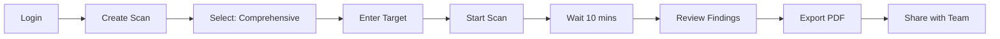
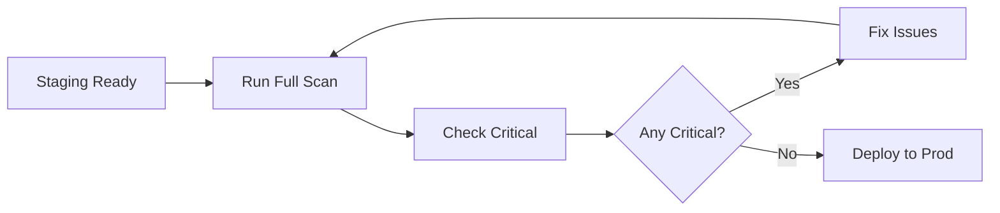
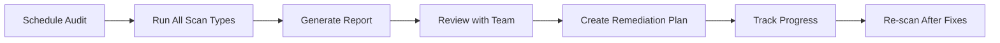

# 🎨 Visual Onboarding & User Guide

**Welcome to CyperSecurity Platform!** This visual guide will help you get started quickly and understand how to use all platform features.

---

## 🚀 Quick Onboarding (4 Simple Steps)

### Your Journey to Security Excellence

**Step 1: Sign Up** (30 seconds)
- Create your account with email and password
- No credit card required

**Step 2: Verify Email** (1 minute)
- Check your inbox for verification email
- Click the secure verification link

**Step 3: Setup Organization** (2 minutes)
- Add your company details
- Select your industry
- Set team size

**Step 4: Activate Trial** (Instant!)
- Automatically get 14-day Pro access
- Full feature access, no limitations
- No credit card required

✅ **Ready to Scan!** You're all set to protect your infrastructure.

---

## 🎯 Quick Start Guide

### Get Results in 3 Simple Steps

#### 1️⃣ Run Your First Scan
- **Enter target domain:** app.example.com
- **Select scan type:** Comprehensive (recommended)
- **Click Start!** Scanning begins immediately

#### 2️⃣ Review Findings
- **View severity levels:** Critical, High, Medium, Low
- **Check CVE details:** Real-time vulnerability intelligence
- **Prioritize fixes:** Start with Critical findings

#### 3️⃣ Generate Report
- **One-click PDF export:** Executive summary ready
- **Share with team:** Email or Slack integration
- **Track remediation:** Monitor fix progress

---

## 🔄 Complete User Journey

### The Security Workflow Cycle

**1. Create Scan**
- Define your target (domain, IP, or application)
- Choose scan type (Nmap, ZAP, SQLMap, or All)

**2. Configure**
- Set scan parameters
- Adjust sensitivity levels
- Schedule for later (optional)

**3. Execute**
- Scan runs automatically
- Real-time progress tracking
- Typically completes in 5-15 minutes

**4. Analyze**
- AI-powered vulnerability analysis
- Automatic CVE enrichment
- MITRE ATT&CK mapping

**5. Report**
- Generate professional PDFs
- Executive and technical reports
- Customizable templates

**6. Notify**
- Automatic team notifications
- Slack, Discord, Email, PagerDuty
- Webhook integrations

🔁 **Rinse and repeat for continuous security!**

---

## ✨ Platform Features

### What You Can Do

#### 🌐 Network Scanning (Nmap)
Discover all open ports, running services, and OS details across your infrastructure.

**Use Cases:**
- Network inventory
- Port exposure audit
- Service version checking

#### 🛡️ Web Scanning (OWASP ZAP)
Test web applications for OWASP Top 10 vulnerabilities automatically.

**Use Cases:**
- Web app security audit
- OWASP Top 10 compliance
- Pre-deployment testing

#### 💉 SQL Testing (SQLMap)
Detect and validate SQL injection vulnerabilities in your databases.

**Use Cases:**
- Database security testing
- API endpoint validation
- Authentication bypass detection

#### 📋 CVE Intelligence (NVD)
Get real-time vulnerability data from the National Vulnerability Database.

**Use Cases:**
- CVE enrichment
- CISA KEV checking
- Exploitability assessment

#### 👥 Team Collaboration
Notify your entire security team instantly via multiple channels.

**Use Cases:**
- Critical finding alerts
- Scan completion notifications
- Remediation tracking

#### 📄 PDF Reports
Export professional reports for executives and technical teams.

**Use Cases:**
- Board presentations
- Compliance audits
- Client deliverables

---

## 💰 Pricing & Plans

### Choose the Right Plan for Your Team

#### 🆓 Free Plan - $0/month
**Perfect for getting started**

- 100 scans per month
- Basic reports
- Email support
- CVE database access

**Best for:** Individual security researchers, students, small projects

#### ⭐ Pro Plan - $99/month (MOST POPULAR)
**For growing security teams**

- **1,000 scans per month**
- Advanced PDF reports
- Priority support
- All integrations (Slack, PagerDuty, Discord)
- Team collaboration
- Analytics dashboard
- **🎁 14-day FREE trial**

**Best for:** Startups, security teams, consultants

#### 👑 Enterprise Plan - Custom Pricing
**For large organizations**

- **Unlimited scans**
- Custom reports
- Dedicated support
- SSO & RBAC
- API access
- SLA guarantee

**Best for:** Fortune 500, enterprises, MSPs

---

## 🏗️ Platform Architecture

### How It Works Under the Hood

#### Frontend Layer
- **React Dashboard:** Modern, responsive UI
- **HTTPS:** Secure communication

#### API Gateway
- **Go Gateway:** High-performance routing
- **Authentication & Authorization:** JWT tokens, RBAC

#### Service Layer
1. **Python Brain:** AI-powered analysis and scanning orchestration
2. **Scanners:** Nmap, OWASP ZAP, SQLMap integration
3. **Analytics:** Product metrics and usage tracking

#### Data Layer
- **PostgreSQL:** Multi-tenant database with Row-Level Security
- **Redis:** High-performance caching and job queues

#### External Integrations
- **Stripe:** Subscription billing and payments
- **SendGrid:** Transactional email delivery
- **Slack:** Real-time team notifications

---

## 📚 Common Workflows

### Workflow 1: Daily Security Scan

**Time:** ~15 minutes  
**Frequency:** Daily  
**Best for:** Continuous monitoring

### Workflow 2: Pre-Deployment Check

**Time:** 20-30 minutes  
**Frequency:** Before each deployment  
**Best for:** DevSecOps integration

### Workflow 3: Compliance Audit

**Time:** 1-2 days  
**Frequency:** Quarterly  
**Best for:** Compliance requirements

---

## 🎓 Video Tutorials (Coming Soon!)

### Beginner Series
- [ ] Getting Started (5 min)
- [ ] Your First Scan (8 min)
- [ ] Understanding Results (10 min)

### Advanced Series
- [ ] Custom Scan Configurations (12 min)
- [ ] API Integration (15 min)
- [ ] Team Collaboration Setup (8 min)

### Enterprise Features
- [ ] SSO Configuration (10 min)
- [ ] RBAC Setup (12 min)
- [ ] Webhook Integration (15 min)

---

## 💡 Tips & Best Practices

### 🎯 For Best Results

**1. Start Small**
- Begin with a single application
- Learn the interface before scaling

**2. Schedule Regular Scans**
- Daily or weekly scans recommended
- Use webhooks for automatic notifications

**3. Prioritize Critical Findings**
- Always fix CRITICAL vulnerabilities first
- Check CISA KEV status for urgency

**4. Leverage Integrations**
- Connect Slack for team alerts
- Use PagerDuty for critical findings
- Set up email notifications

**5. Export Reports Regularly**
- Keep PDF records for compliance
- Share with stakeholders monthly

### ⚠️ Common Pitfalls to Avoid

**❌ Don't:**
- Scan production without permission
- Ignore Medium/Low findings completely
- Run too many concurrent scans
- Skip email verification

**✅ Do:**
- Get authorization for all scans
- Create remediation plans for all findings
- Respect scan quotas
- Complete onboarding fully

---

## 🆘 Need Help?

### Support Resources

**📖 Documentation**
- [User Guide](/docs/USER_GUIDE.md)
- [API Documentation](/docs/API_DOCUMENTATION.md)
- [Knowledge Base](/docs/KNOWLEDGE_BASE.md)

**💬 Community**
- GitHub Discussions
- Discord Community Server
- Stack Overflow Tag

**📧 Direct Support**
- **Free Plan:** Email support (48h response)
- **Pro Plan:** Priority email (24h response)
- **Enterprise:** Dedicated Slack channel (4h response)

**🚨 Emergency Support**
- Enterprise customers only
- 24/7 phone support
- SLA-backed response times

---

## 🚀 Ready to Get Started?

**You now have everything you need to:**

✅ Complete onboarding in 4 simple steps  
✅ Run your first security scan  
✅ Understand all platform features  
✅ Choose the right pricing plan  
✅ Follow security best practices  

**Let's secure your infrastructure!** 🛡️

[Start Free Trial](https://app.cypersecurity.com/signup) → Get 14 days of Pro access, no credit card required!

---

*Last Updated: January 1, 2026*  
*Platform Version: 1.0.0*  
*Status: Production Ready*
